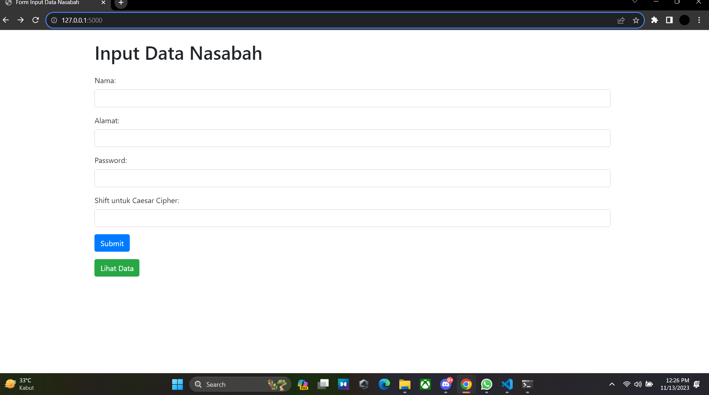
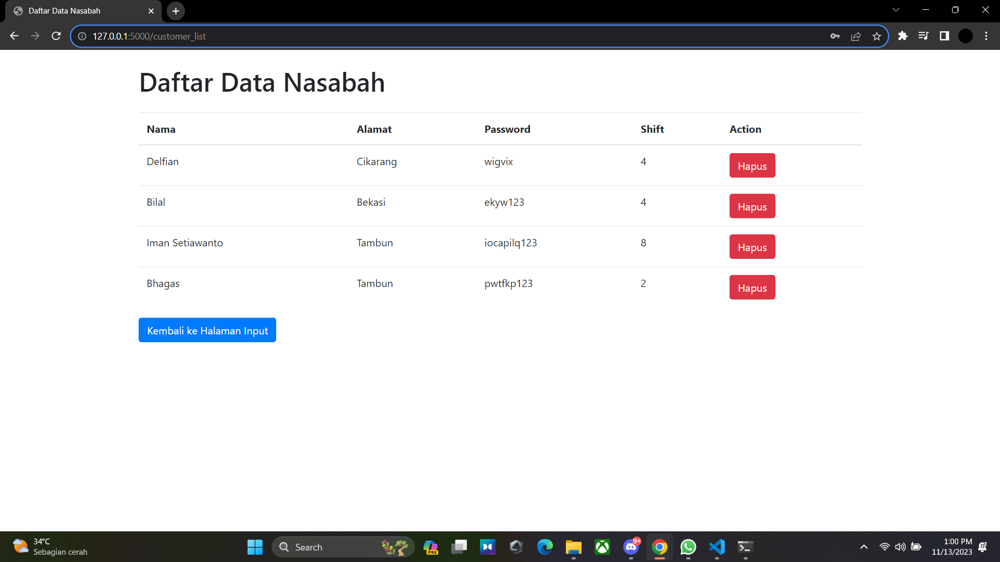

# UTS Kriptografi
## Profil
**_<p>Nama: Delfian Ruly Havatilla</p>_**
**_<p>Kelas: TI.21.A.1</p>_**
**_<p>Nim: 312110161</p>_**

---

# Aplikasi Web Sederhana untuk Entri Data Nasabah dengan Enkripsi Ceasar Cipher

Aplikasi ini adalah aplikasi web yang memungkinkan pengguna untuk mengisi formulir dan melihat data nasabah. Aplikasi ini mengenkripsi kata sandi pengguna menggunakan Ceasar Cipher dan menyimpan data dalam database SQLite.

## Cara Program Bekerja

Aplikasi ini terdiri dari aplikasi web Flask dan menggunakan Caesar Cipher untuk mengenkripsi kata sandi. Berikut adalah gambaran singkat tentang cara program ini bekerja:

1. **Inisialisasi**:
   - Aplikasi diinisialisasi menggunakan Flask.
   - Database SQLite dibuat atau dihubungkan, yang menyimpan data pelanggan.

2. **Antarmuka Pengguna**:
   - Pengguna dapat mengakses halaman-halaman berikut:
     - Halaman beranda (`/`): Menampilkan bilah navigasi dan formulir untuk memasukkan data pelanggan.
     - Halaman data (`/data`): Menampilkan tabel data pelanggan.

3. **Entri Data dan Enkripsi**:
   - Pengguna mengisi formulir dengan nama, alamat, kata sandi, dan kunci Caesar Cipher.
   - Kata sandi dienkripsi menggunakan Caesar Cipher dan disimpan dalam database.

4. **Melihat Data**:
   - Pengguna dapat melihat data pelanggan pada halaman data.
   - Hal ini menampilkan nama pelanggan, alamat, kata sandi terenkripsi, dan kunci Caesar Cipher.

5. **Logout**:
   - Pengguna dapat logout, yang menghapus informasi sesi.

## Menjalankan Aplikasi

Untuk menjalankan aplikasi E-FORM, ikuti langkah-langkah berikut:

1. Pastikan Anda telah menginstal Flask. Jika belum, Anda dapat menginstalnya dengan perintah `pip install flask`.

2. Jalankan skrip `app.py`:
   ```
   python app.py
   ```

3. Buka browser web dan arahkan ke `http://localhost:5000` untuk mengakses aplikasi.

## Output

  - Halaman Form Input
  
  
  - Halaman Tabel Data
  
  
### Terima Kasih!

---